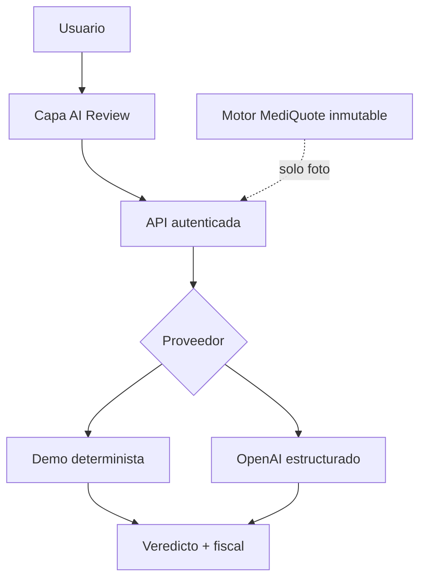

# Arquitectura

La ruta `/api/ai-review` es de servidor, requiere sesión y acepta acciones tipadas. El proveedor demo es el predeterminado. El proveedor OpenAI usa salidas estructuradas, `store:false`, límite de tiempo y un reintento.
